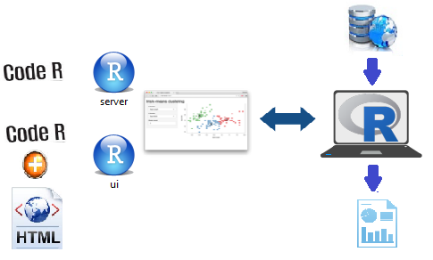

## Funcionamiento shiny apps {.build}
* __Ventajas:__
    + Ejecución de scripts mediante botones (widgets).
    + Automatización total de procesos.
    + Generación de interfaces sin necesidad de Java, CSS, etc.
    + Implementación de potentes modelos estadísticos.

\n

* __Esquema shiny app__:

## Extracto Personal

 
     
     

* __Información profesional:__
    + Ingeniero Matemático. EPN (2014).
    + Docente de Estadística en EPN.

* __Áreas de interés:__
    + Estadística Computacional, Minería de Datos,
    + R Programming, Riesgo Financiero,
    + Pronósticos, Georeferenciación.
    
* __R paquetes:__
    + shiny, ggplot2,
    + data table, dplyr.
    + Knitr, rmarkdown. 
* __Contactos:__
    + alex.perezt@epn.edu.ec
    + http://www.consultoresmatematicos.com
    + https://github.com/alexeperez

## Auspiciantes
\n

\n

<a href=http://www.consultoresmatematicos.com> 
       
              <b>  MS-PLUS Consultores 
               </b> </a>
       

              
<a href=http://usuariosrec.github.io/Web>  
              <b>  R Users Group Ec 
               </b> </a>
              
              
              